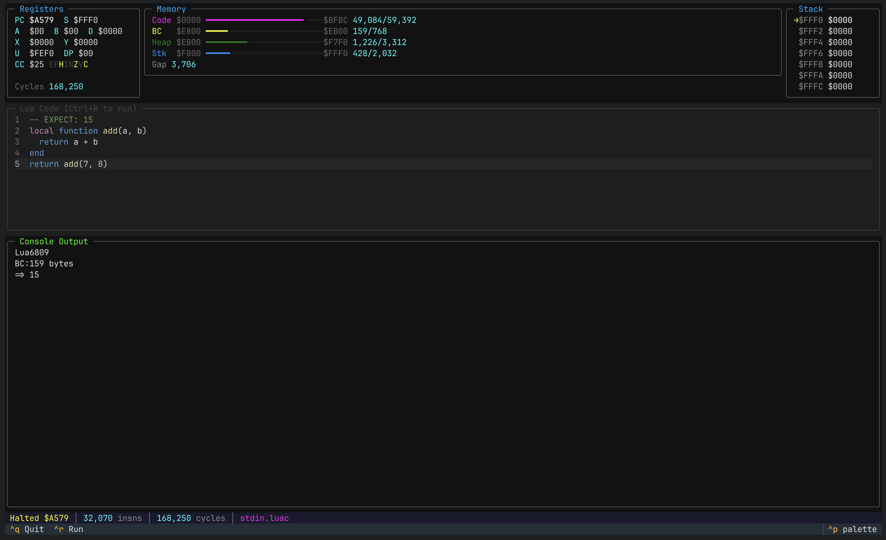

# Lua 6809

Porting the Lua 5.1.5 VM to run on bare-metal Motorola MC6809.

## Current Status

**The VM runs.** 29 tests passing across core language features:

| Category | Tests | Features |
|----------|-------|----------|
| Arithmetic | 9 | add, sub, mul, div, mod, unary minus, overflow |
| Boolean | 2 | and/or, short-circuit evaluation |
| Comparison | 3 | ==, ~=, <, >, <=, >= |
| Conditionals | 1 | if/elseif/else |
| Functions | 4 | calls, closures, multiple returns, nested functions |
| Loops | 3 | for, while, repeat/until |
| Recursion | 4 | factorial, fibonacci, GCD |
| Tables | 3 | arrays, hash tables, nested tables |

```bash
nix run .#test
```

### What Works

- ~48KB VM binary fits in memory
- 32-bit integer math (no floats)
- Pre-compiled bytecode execution
- Memory-mapped console output
- Tables, functions, closures, recursion
- All standard control flow

### What's Missing

- Standard library (print, string, table, math modules)
- Garbage collection tuning for constrained memory
- Coroutines (untested)
- Real hardware testing (emulator only so far)

## Architecture

Scripts are compiled on the host, then only the bytecode interpreter runs on the 6809:

```
script.lua
    │
    ▼
┌─────────────────┐
│   luac-int32    │  Lua compiler patched for 32-bit integers
└────────┬────────┘
         │
         ▼
┌─────────────────┐
│ luac_convert.py │  Fix endianness for 6809
└────────┬────────┘
         │
         ▼
  6809 bytecode ──────► lua.s19 (VM) ──────► output
  loaded at $E800       ~48KB binary        via $F7F0
```

### Memory Map

| Address | Size | Purpose |
|---------|------|---------|
| `$0000-$BFBC` | ~48KB | Lua VM code |
| `$E800-$EAFF` | 768B | Bytecode (loaded by emulator) |
| `$EB00-$F7EF` | ~3KB | Heap (grows up) |
| `$F7F0` | 1B | Output port (memory-mapped I/O) |
| `$F800-$FFF0` | ~2KB | Stack (grows down) |

## Anachron8 Target

A second build places the VM in the [Anachron8](https://git.sherwood.haus/blark/isp-6809)
6809 computer's memory map (I/O at `$0000`, MON09 ROM at `$E000`, VRAM at `$C000`):

| Address | Purpose |
|---------|---------|
| `$1000-$B125` | VM code + data (~41 KB; unused API functions left out with `LUA_SLIM`) |
| end of program-`$BFFF` | Heap (~3.8 KB, start from the linker via `a8heap.s`) |
| `$C000` | Output: 80x25 VRAM text screen, plus every character on the ACIA |
| `$D000-$DBFF` | Bytecode (2-byte size, then the bytecode) |
| below `$DF60` | Stack (MON09's user stack) |

The VM starts at `_a8_start` (`a8start.s`: sets S to `$DF60`, then crt0), which the build
writes into the S9 record of `lua-a8.s19` (also in `lua-a8.map`). Start it with MON09's `G`
at that address, or through a reset with the SPI loader's vector shadow. It returns to MON09 when
done by jumping through the reset vector (MON09 restarts and prompts), with `D=$1A8E`
for a normal exit or `D=$DEAD` for `abort()`. (Not `SWI`: MON09 sends a non-breakpoint
SWI to its RAM vector at `$DF60`, which is `0000` after reset.)

```bash
nix build .#vm-a8          # result/lua-a8.s19 (+ lua-a8.map)
nix run .#test-a8          # test suite on the Anachron8 memory model (emu/anachron8.py)
luac6809 -o prog.luac prog.lua && tools/bytecode_s19.py prog.luac   # prog.s19 at $D000
```

The Anachron8 memory model is strict: writes to ROM or unmapped I/O, and loads
outside RAM, stop the run with a bus error.

## Getting Started

Requires [Nix](https://nixos.org/) with flakes enabled.

```bash
# Enter development environment
nix develop

# Or with direnv
direnv allow
```

### Commands

| Command | Description |
|---------|-------------|
| `luac6809 script.lua` | Compile Lua to 6809 bytecode |
| `regen-patch` | Regenerate patch after editing lua-work/ |
| `nix run .#test` | Run test suite |

### Running Manually

```bash
# Compile a script
luac6809 -o test.luac script.lua

# Run in emulator (verbose output)
uv run emu/harness.py test.luac

# Run in TUI emulator
uv run emu/visual.py
```



## Development Workflow

The Lua source is patched, not forked. To modify:

1. Edit files in `lua-work/src/`
2. Run `regen-patch` to update `patches/6809-phase1.patch`
3. Run `direnv reload` to rebuild

### Key Files

| File | Purpose |
|------|---------|
| `lua-work/src/lua6809.c` | Bare-metal runtime (malloc, I/O, main) |
| `lua-work/src/luaconf.h` | Platform configuration |
| `patches/6809-phase1.patch` | All modifications to Lua source |
| `tools/luac_convert.py` | Bytecode endianness converter |
| `emu/runner.py` | Test harness for MC6809 emulator |

## Technical Details

### Modifications to Lua

| Change | Reason |
|--------|--------|
| `LUA_NUMBER` = `long` | 32-bit integers instead of doubles |
| Parser/lexer stubbed out | Bytecode-only mode saves ~15KB |
| Custom `malloc`/`sbrk` | Bump allocator for bare metal |
| Memory-mapped I/O | Output to $F7F0 instead of printf |
| Reduced limits | MAXCALLS=100, MAXCSTACK=128 |

### gcc6809 Workarounds

The gcc6809 cross-compiler has bugs that required workarounds:

1. **Indirect call offset bug** - After pushing to stack, indirect calls use the wrong offset. Fixed by copying function pointers to local variables before calls.

2. **32-bit multiply bug** - Patched in [gcc6809-nix](https://github.com/blark/gcc6809-nix).

### Toolchain

- [gcc6809](https://github.com/blark/gcc6809-nix) - GCC 4.3.6 cross-compiler
- [newlib](https://sourceware.org/newlib/) - C library (setjmp, memcpy, etc.)
- [MC6809](https://pypi.org/project/MC6809/) - Python emulator for testing

## License

Lua is MIT licensed. See [lua.org/license.html](https://www.lua.org/license.html).
